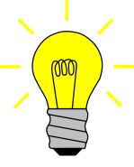

### Hi there 👋

<!--
**RobsonSF/RobsonSF** is a ✨ _special_ ✨ repository because its `README.md` (this file) appears on your GitHub profile.
-->

<h2>Hello World ☕</h2>

<h1>I'm Robson... </h1>

 

<ul>
    <li>
        :books: I am currently in the last period of the Systems Analysis and Development course
    </li>
    <li>
        :coffee: learning and updating myself about the JAVA stack
    </li>
    <li>
        :lipstick: learning Angular (Bootcamp - Potência Tech Angular Developer - Powered by iFood)
    </li>
    <li>
        :ok_hand: learning microservices, clean code, clean architecture
    </li>

 

<h3 align="left">Connect with me:</h3> 
  
  
